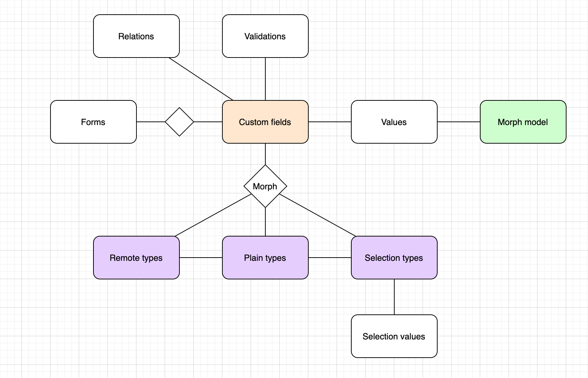

<p align="center"><a href="https://see.asseco.com" target="_blank"></a></p>

# Custom fields

Purpose of this repository is to provide custom field support for any Laravel model. 

**Custom field** can be any field with which you wish to extend your model providing
a highly flexible model for additional fields, without the need to add new attributes 
to a DB model.

## Installation

Require the package with ``composer require asseco-voice/laravel-custom-fields``.
Service provider will be registered automatically.

## Setup

In order to use this repository the following must be done:

1. Each model which requires custom field support MUST use ``Customizable`` trait. 
1. Run ``php artisan migrate`` to migrate package tables
1. Run ``php artisan db:seed --class="Asseco\CustomFields\Database\Seeders\PlainTypeSeeder"``
to seed mandatory data only. 
1. You may include ``CustomFieldPackageSeeder`` within your ``DatabaseSeeder``
seeders and have it seed mandatory data in all environments or seed all other dummy data in
non-production environments. 

## ERD



# Custom field types breakdown

A single custom field can assume the form of one of three different types of custom fields, all of which 
are a polymorphic relation to custom fields table.

#### Plain type

Plain types are a standard single-value properties like int/string/date etc. Be sure to seed the mandatory
data before you go and use the package as these fields map directly to custom field value attributes depending on
their type. 

I.e. if you say that custom field is of a plain string value, its value will be written in the string column of
a custom field values table. 

#### Remote type

If you'd like to fetch custom fields from some arbitrary endpoint, you can use remote type. Remote type has standard
URL/method/headers/body attributes so that your request can be executed successfully. 

Using remote type custom fields require you to define which plain types are you ultimately returning so that 
package knows how to map the values to their attribute columns.  

#### Selection type

Selection types provide a set of predefined values from which you can select one or many. 

Selection types also require you to define which plain types are you ultimately returning so that 
package knows how to map the values to their attribute columns.  

# Defining custom fields

Once all the mandatory data is seeded you can start defining custom fields. You can do so in several 
ways:
- through ``/api/custom-fields`` CRUD controller endpoints if you wish to provide all the fields necessary
for defining a single custom field
- through helper endpoints (where `plain_type` parameter is one of plain types defined in the DB. Using 
invalid parameter will result in 404):
    - ``/api/custom-field/plain/{plain_type}`` - for creating plain type custom-field.
    - ``/api/custom-field/selection/{plain_type}`` - for creating selection type custom-field.
    - ``/api/custom-field/remote`` - for creating remote type custom-field. 
    Omitting the `plain_type` attribute and hard-coding to string currently.
- with Tinker in the console

Once a custom field is defined, you can add a value for a particular model against that custom field. 

I.e. if you have a ``Contact`` model, instead of adding a `car` attribute to `contacts` table, you can define
a string plain type custom field ``car`` for `Contact` model. At that point, no `Contact` has a value assigned to it.
Only when custom field is defined can you go and say that for example ``Contact`` with ID 5 has a Volvo.   

## Custom field attributes

- ``name`` - unique name of the custom field.
- ``label`` - user-friendly name of a custom field.
- ``placeholder`` - placeholder.
- ``selectable`` - polymorphic attribute (`_type`, `_id`) which can assume [one of 3 available types](#custom-field-types-breakdown).
- ``model`` - namespace of the model for which the custom field will be applicable.
- ``required`` - is a custom field required. Default `false`.
- ``validation_id`` - relation to [validation field](#validation).
- ``group`` & `order` - nullable front-end friendly strings to provide grouping if needed. 

## Plain type attributes

Plain types have only ``name`` defined. These map to `custom_field_values` table attributes so be sure 
to seed mandatory types.

This is done because of data validation on DB level as well as faster value searching. 

I.e. one of plain types is ``string``, and looking at `custom_field_values` migration you'll notice that
there is a ``string`` attribute as well.  

## Selection type attributes

Selection types have two tables: ``selection_types`` and `selection_values`.

Selection types have defined ``plain_type_id`` which is a plain type that selection values should be mapped to.
It is not possible to have plain type values of mixed types. There is also a ``multiselect`` boolean which should
indicate to front-end whether it is possible to select only one or multiple values from the list.

Values table holds all values which should for a particular selection field be available to pick. There are 
standard ``label`` and `value` fields for selections as well as `preselect` bool which should indicate to the front-end
whether the value should be preselected (kinda like placeholder for selection). 

## Remote type attributes

Remote types have standard ``url, method, body, headers`` attributes to define an endpoint from where the 
fields should be fetched. 

You can resolve the values on ``/api/custom-field/remote/{remote_type}/resolve`` endpoint.

While resolving the values from an endpoint, there is also a possibility to provide ``mappings``. If set to `null` 
the response will be returned as-is. Otherwise, there is a possibility to provide mappings 
in `localKey => remoteKey` which means that response will be remapped to JSON provided in the `mappings` field.

I.e. 
```
Response:
{
    "remote_user": "foo"
}

Mapping: 
{
    "user": "remote_user"
}

Result:
{
    "user": "foo"
}
```

# Using custom fields

Once you have custom fields defined, you can start assigning values to models. You can do so by hitting the 
``/api/custom-field/values`` endpoint. Be sure to provide the right value in the request (i.e. for string field
provide a `string` attribute in the payload) because otherwise the package will reject the value as invalid. 

During value storing, aside from value type check, you can also add [regex validation](#validation) to a custom 
field which will be validated at that point as well.

# Validation 

You can provide regex validation for a custom field in a ``/pattern/`` or `pattern` format. You can assign
it a ``name`` if needed for front-end purposes, as well as setting `generic` bool option which is also a front-end
helper designed to filter out most common used validations. You can set those to ``true`` and then return only 
``true`` ones in front-end dropdown.

# Relationship

Providing a parent-child M:M relationship on custom fields.

# Form

Form is a helper model for our specific [form.io](https://www.form.io/) use case.

When creating a form, its definition will be parsed and will automatically relate
custom fields used on an M:M pivot table. Parsing works on [form.io](https://www.form.io/)
definition only. 

If you want to make your own parser, you can publish the config file and replace
``Form`` model implementation with your form. Extend the parent model and override
``relateCustomFieldsFromDefinition()`` function. 

# Extending the package

Publishing the configuration will enable you to change package models as
well as controlling how migrations behave. If extending the model, make sure
you're extending the original model in your implementation.
